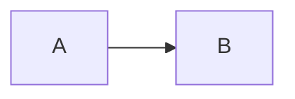
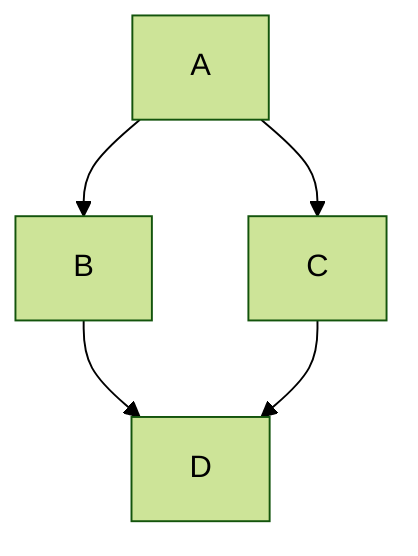

Academic Pages ships with built-in support for three visualization tools: [MathJax](https://docs.mathjax.org/en/latest/) for typeset mathematics, [Mermaid](https://mermaid.js.org/) for diagrams and flowcharts, and [Plotly](https://plotly.com/javascript/) for interactive data charts. All three are loaded via [jsDelivr](https://www.jsdelivr.com/) CDN and activate automatically on pages that contain the relevant syntax — no additional configuration is needed.

---

## MathJax (version 3)

Academic Pages includes MathJax version 3 served via jsDelivr. You write LaTeX directly in your Markdown files and MathJax renders it in the browser.

### Display math

Use `$$...$$` or `\[...\]` delimiters to typeset a block-level (displayed) equation:

```latex
$$
\displaylines{
\nabla \cdot E= \frac{\rho}{\epsilon_0} \\
\nabla \cdot B=0 \\
\nabla \times E= -\partial_tB \\
\nabla \times B  = \mu_0 \left(J + \varepsilon_0 \partial_t E \right)
}
$$
```

The `\displaylines` command keeps each equation on its own line within a single block, which is useful for multi-line equation systems like Maxwell's equations shown above.

### Inline math

Use `\(...\)` delimiters for inline mathematics — for example, writing `\(a^2 + b^2 = c^2\)` within a sentence. You can also use `$$...$$` inline, but `\(...\)` is the preferred form inside prose.

```markdown
The Pythagorean theorem states that \(a^2 + b^2 = c^2\).
```

### Escaping gotchas with Kramdown

Because Academic Pages renders Markdown with Kramdown before MathJax processes the output, some LaTeX characters can be consumed by the Markdown parser first.

<Warning>
The double-backslash `\\` used for LaTeX line breaks is interpreted by Kramdown as a hard line break. Inside `$$...$$` blocks you may need `\\\` (three backslashes) to produce a single LaTeX `\\`. Consult the [Kramdown–MathJax workaround post](https://math.codidact.com/posts/278763/278772#answer-278772) for a full explanation.
</Warning>

In `citation` fields inside publication front matter, the Markdown parser can interfere with `$$...$$` delimiters. In those contexts, use `\(...\)` for inline math instead:

```yaml
citation: 'See also \(E = mc^2\) for context.'
```

---

## Mermaid diagrams (version 11)

Academic Pages includes Mermaid version 11 via jsDelivr. Diagrams are written as fenced code blocks with the language identifier `mermaid`.

### Basic graph

````markdown

````

This produces a simple left-to-right flow graph with the default Mermaid theme applied automatically.

### Themed diagram

You can specify a Mermaid theme using a YAML front matter block at the top of the diagram. For example, to use the `forest` theme on a top-down graph:

````markdown

````

<Tip>
Mermaid supports several built-in themes including `default`, `forest`, `dark`, `neutral`, and `base`. The `forest` theme uses greens and is popular on academic sites. See the [Mermaid theming documentation](https://mermaid.js.org/config/theming.html) for a full list.
</Tip>

### Diagram types

Beyond flow graphs, Mermaid supports sequence diagrams, Gantt charts, class diagrams, and more. The [Mermaid tutorials](https://mermaid.js.org/ecosystem/tutorials.html) and [GitHub documentation](https://github.com/mermaid-js/mermaid) cover the full syntax.

---

## Plotly charts

Academic Pages supports [Plotly](https://plotly.com/javascript/) charts through a hook in the Markdown code block renderer. You write chart data as JSON inside a fenced code block with the language identifier `plotly`. The template parses the JSON, then passes it to Plotly's JavaScript library along with a theme that matches the current site theme (light or dark).

Plotly is loaded lazily via CDN — the library is only fetched when a page actually contains a `plotly` code block.

<Warning>
Plotly data is parsed as strict JSON. **All keys must be quoted.** Unquoted keys like `{data: [...]}` will cause a parse failure and the chart will not render. Use a tool like [JSONLint](https://jsonlint.com/) to validate your data before committing.
</Warning>

### What you can configure

The `data` attribute accepts any [Plotly trace attributes](https://plotly.com/javascript/reference/index/). The `layout` attribute controls titles, axis ranges, and grid configuration. Because the theme (colors, background, font) is injected automatically based on the site's light/dark mode, avoid hard-coding colors in `layout` if you want the chart to look correct in both modes.

### Scatter chart

A minimal two-series scatter chart:

````markdown
```plotly
{
  "data": [
    {
      "x": [1, 2, 3, 4],
      "y": [10, 15, 13, 17],
      "type": "scatter"
    },
    {
      "x": [1, 2, 3, 4],
      "y": [16, 5, 11, 9],
      "type": "scatter"
    }
  ]
}
```
````

### Scatter chart with labels and layout

A more detailed example using marker sizes, hover text, and explicit axis ranges:

````markdown
```plotly
{
  "data": [
    {
      "x": [1, 2, 3, 4, 5],
      "y": [1, 6, 3, 6, 1],
      "mode": "markers",
      "type": "scatter",
      "name": "Team A",
      "text": ["A-1", "A-2", "A-3", "A-4", "A-5"],
      "marker": { "size": 12 }
    },
    {
      "x": [1.5, 2.5, 3.5, 4.5, 5.5],
      "y": [4, 1, 7, 1, 4],
      "mode": "markers",
      "type": "scatter",
      "name": "Team B",
      "text": ["B-a", "B-b", "B-c", "B-d", "B-e"],
      "marker": { "size": 12 }
    }
  ],
  "layout": {
    "xaxis": { "range": [0.75, 5.25] },
    "yaxis": { "range": [0, 8] },
    "title": { "text": "Data Labels Hover" }
  }
}
```
````

### Subplot example

Use `layout.grid` to arrange multiple traces in a side-by-side layout:

````markdown
```plotly
{
  "data": [
    {
      "x": [1, 2, 3],
      "y": [4, 5, 6],
      "type": "scatter"
    },
    {
      "x": [20, 30, 40],
      "y": [50, 60, 70],
      "xaxis": "x2",
      "yaxis": "y2",
      "type": "scatter"
    }
  ],
  "layout": {
    "grid": {
      "rows": 1,
      "columns": 2,
      "pattern": "independent"
    },
    "title": { "text": "Simple Subplot" }
  }
}
```
````

### Contour plot

Contour plots use a 2D `z` array:

````markdown
```plotly
{
  "data": [{
    "z": [
      [10, 10.625, 12.5, 15.625, 20],
      [5.625, 6.25, 8.125, 11.25, 15.625],
      [2.5, 3.125, 5.0, 8.125, 12.5],
      [0.625, 1.25, 3.125, 6.25, 10.625],
      [0, 0.625, 2.5, 5.625, 10]
    ],
    "type": "contour"
  }],
  "layout": {
    "title": { "text": "Basic Contour Plot" }
  }
}
```
````

<Note>
Plotly charts automatically inherit the site's light or dark theme. The template uses the `plotly_white` template for light mode and `plotly_dark` for dark mode, matching the color palette defined in `assets/js/theme.js`. This means you do not need to specify background or font colors in your chart JSON.
</Note>
