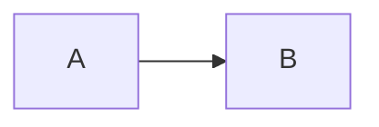

Academic Pages is a GitHub Pages template designed specifically for researchers, academics, and anyone who needs a professional portfolio-oriented personal website. Built on top of the [Minimal Mistakes Jekyll theme](https://mmistakes.github.io/minimal-mistakes/), it extends that foundation with structured content types that academics actually use — publications, talks, teaching experience, a portfolio, blog posts, and a dynamically generated CV — all hosted for free on GitHub Pages with no ads, no subscriptions, and no server to maintain.

## How GitHub Pages Hosting Works

When you fork the Academic Pages repository and rename it to `[yourusername].github.io`, GitHub Pages automatically takes over. Every time you commit and push a change — whether that's editing a Markdown file, updating `_config.yml`, or adding a new PDF — GitHub Pages runs Jekyll to rebuild the static HTML and serves it from GitHub's infrastructure, free of charge.

Your site's content lives in plain Markdown (`.md`) and YAML (`.yml`) files inside the repository. The Jekyll theme reads those files and transforms them into HTML pages, keeping your content completely separate from the presentation layer. This means you can overhaul the theme without touching a single line of your research data, or you can update your publications list without knowing anything about HTML or CSS.

<Note>
  GitHub Pages rebuilds your site automatically on every push. You can monitor the build status (green check, orange circle, or red X) in the **Settings → Pages** section of your repository.
</Note>

## Content Collections

Academic Pages organizes your site content into distinct collections. Each collection is a folder of Markdown files in the repository root — one file per item — and each file uses a YAML front matter block to supply structured metadata that the theme uses to build list pages, individual item pages, the CV page, and more.

<CardGroup cols={2}>
  <Card title="Publications" icon="book-open">
    Stored in `_publications/`. Each file supports `title`, `date`, `venue`, `excerpt`, `paperurl`, `slidesurl`, `bibtexurl`, and `citation` fields. Publications are grouped by category (`books`, `manuscripts`, `conferences`) as defined in `_config.yml`.
  </Card>
  <Card title="Talks" icon="microphone">
    Stored in `_talks/`. Each file records `title`, `type`, `venue`, `date`, `location`, and a free-form Markdown description. Talk metadata is also used to generate the optional talk map visualization.
  </Card>
  <Card title="Teaching" icon="graduation-cap">
    Stored in `_teaching/`. Entries capture course titles, institution, dates, and rich Markdown descriptions — useful for documenting course design, syllabi links, or teaching philosophy.
  </Card>
  <Card title="Portfolio" icon="briefcase">
    Stored in `_portfolio/`. Items can be `.md` or `.html` files and support embedded images via the `excerpt` field. Portfolio pages are well-suited for project write-ups, software packages, or visual work samples.
  </Card>
  <Card title="Blog Posts" icon="pencil">
    Stored in `_posts/` following Jekyll's standard `YYYY-MM-DD-title.md` naming convention. Posts support `tags`, `categories`, read-time estimates, comments, and social sharing — all controlled via `_config.yml` defaults.
  </Card>
  <Card title="CV" icon="file-lines">
    Available in two formats: a hand-edited Markdown page at `_pages/cv.md`, or a JSON-driven layout that reads from `_data/cv.json`. Switch between them by updating the CV link in `_data/navigation.yml`.
  </Card>
</CardGroup>

## Site Themes

The template ships with six built-in color themes, each with automatic light and dark variants. Set your preferred theme in `_config.yml` with the `site_theme` key:

```yaml
# _config.yml
site_theme: "default"   # Options: "default", "air", "sunrise", "mint", "dirt", "contrast"
```

## Navigation

The top navigation bar is controlled by `_data/navigation.yml`. Each entry has a `title` and a `url`. Removing an entry hides that section from the header without deleting any of its content from the site.

```yaml
# _data/navigation.yml
main:
  - title: "Publications"
    url: /publications/
  - title: "Talks"
    url: /talks/
  - title: "Teaching"
    url: /teaching/
  - title: "Portfolio"
    url: /portfolio/
  - title: "Blog Posts"
    url: /year-archive/
  - title: "CV"
    url: /cv/
```

## Sidebar Author Profile

The left-hand sidebar is populated entirely from the `author:` block in `_config.yml`. Fields that are left blank are automatically hidden — no icon or link will appear for empty entries. The sidebar supports a wide range of academic and social profile links including Google Scholar, ORCID, PubMed, arXiv, ResearchGate, GitHub, LinkedIn, Bluesky, and more.

```yaml
# _config.yml — author block (excerpt)
author:
  avatar    : "profile.png"
  name      : "Your Sidebar Name"
  pronouns  : "she/her"
  bio       : "Short biography for the left-hand sidebar"
  location  : "Earth"
  employer  : "Red Brick University"
  email     : "you@example.org"
  googlescholar : "https://scholar.google.com/citations?user=YOURID"
  orcid         : "https://orcid.org/yourorcidurl"
  github        : "yourusername"
```

## Supported Integrations

Academic Pages includes built-in support for several tools commonly used in academic and scientific writing, all enabled through Markdown code fences or `_config.yml` settings — no plugin installation required.

### MathJax

MathJax 3 (via jsDelivr CDN) is included out of the box. Use `$$...$$` or `\[...\]` delimiters for display equations and `\(...\)` for inline math:

```markdown
Display equation:
$$
\nabla \cdot E = \frac{\rho}{\epsilon_0}
$$

Inline math: The equation \(a^2 + b^2 = c^2\) is Pythagoras's theorem.
```

### Mermaid Diagrams

Mermaid 11 (via jsDelivr CDN) renders diagrams declared inside fenced code blocks tagged with `mermaid`:

````markdown

````

### Plotly

Plotly is included as an npm package (`plotly.js-dist-min`) and lazy-loaded from a CDN when a page requires it. Render interactive charts by placing Plotly-compatible JSON inside a `plotly` fenced code block:

````markdown
```plotly
{
  "data": [
    {
      "x": [1, 2, 3, 4],
      "y": [10, 15, 13, 17],
      "type": "scatter"
    }
  ]
}
```
````

The template automatically applies a color theme that matches the active site theme (light or dark).

### Analytics

Google Analytics is supported through the `analytics:` block in `_config.yml`. The `provider` field accepts `"google"`, `"google-universal"`, `"google-analytics-4"`, or `"custom"`:

```yaml
# _config.yml
analytics:
  provider: "google-analytics-4"
  google:
    tracking_id: "G-XXXXXXXXXX"
```

### Comments

The `comments:` block in `_config.yml` supports multiple providers: `disqus`, `discourse`, `facebook`, `staticman`, and `custom`. Set `provider` to your chosen service and fill in the provider-specific fields beneath it.

```yaml
# _config.yml
comments:
  provider: "disqus"
  disqus:
    shortname: "your-disqus-shortname"
```

## Markdown Generator

The `markdown_generator/` directory contains Python scripts and Jupyter notebooks that convert CSV or TSV spreadsheets of publications and talks into correctly formatted Markdown files. This is useful if you already maintain your bibliography in a spreadsheet: run the script once to generate all the individual collection files, then commit them to the repository.

<Tip>
  The `PubsFromBib.ipynb` notebook and `pubsFromBib.py` script can generate publication Markdown files directly from a `.bib` BibTeX file, and `OrcidToBib.ipynb` can pull your bibliography from your ORCID profile first.
</Tip>

## Jekyll Plugins

The template ships with the following Jekyll plugins declared in the `Gemfile` and `_config.yml`:

| Plugin | Purpose |
|---|---|
| `jekyll-feed` | Generates an Atom RSS feed at `/feed.xml` |
| `jekyll-sitemap` | Generates a `sitemap.xml` for search engines |
| `jekyll-redirect-from` | Enables permalink redirects via front matter |
| `jemoji` | Renders GitHub-style emoji shortcodes |
| `jekyll-gist` | Embeds GitHub Gists |
| `jekyll-paginate` | Paginates blog post archives |

All plugins are on GitHub Pages' allowlist, so they work without any additional configuration when hosting on GitHub Pages.
